# CaSMM

> Computation and Science Modeling through Making

Cloud-based programming interface


<br/>

## Project Features

A) State Tracking  
<p align="center">
  <a href="https://github.com/CEN3031-Group9c/sapphire-project01-9c/tree/testing-branch">
    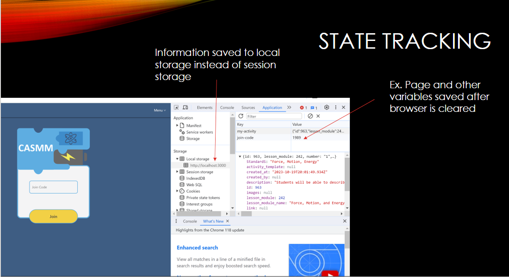
  </a>
</p>
B) Allow option to remember login credentials on sign in  
<br/>
See video walk through
<br/>
(https://drive.google.com/drive/folders/1bUR6YY55WtoKYku4DTaDlQ6UVCy6K3r6)
<br/>
C) Multi-Device Support  
<p align="center">
  <a href="https://github.com/CEN3031-Group9c/sapphire-project01-9c/tree/testing-branch">
    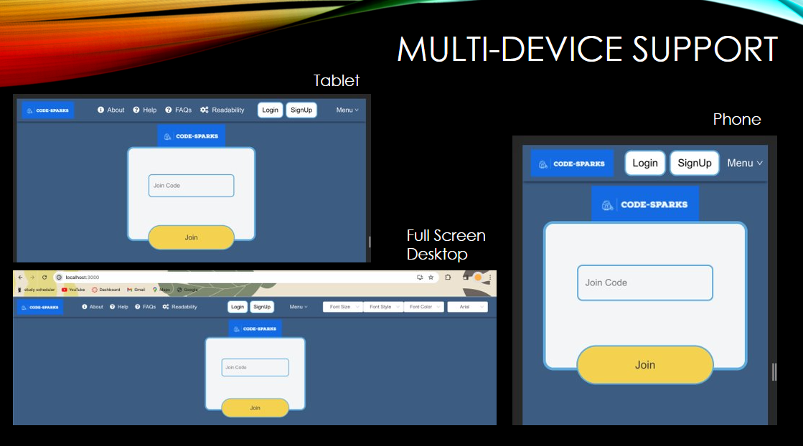
  </a>
</p>
D) Language Translation  
<p align="center">
  <a href="https://github.com/CEN3031-Group9c/sapphire-project01-9c/tree/testing-branch">
    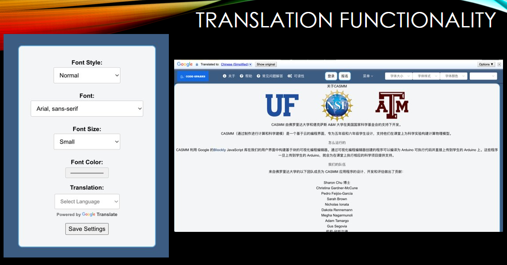
  </a>
</p>
E) Accessibility Options  
<p align="center">
  <a href="https://github.com/CEN3031-Group9c/sapphire-project01-9c/tree/testing-branch">
    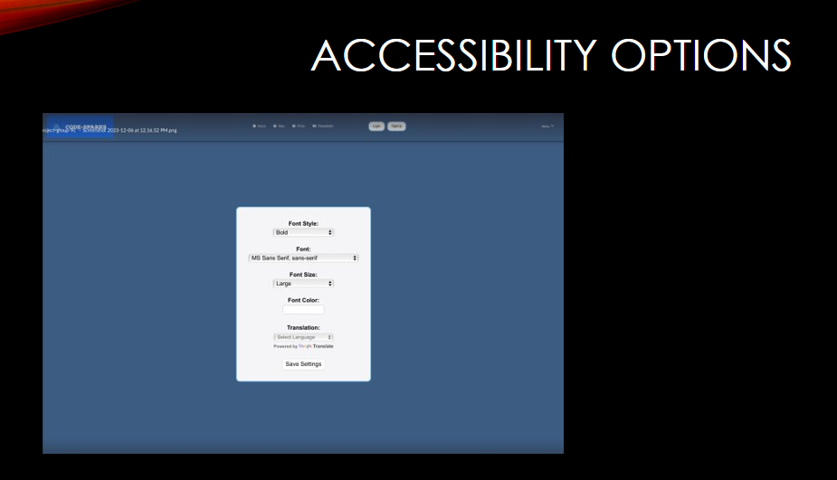
  </a>
</p>
F) Accept user-input to change font size, style, and color  
<p align="center">
  <a href="https://github.com/CEN3031-Group9c/sapphire-project01-9c/tree/testing-branch">
    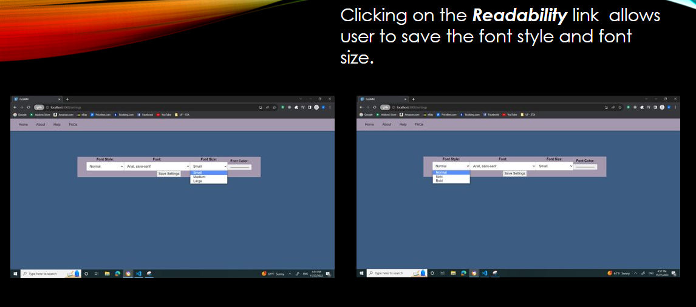
  </a>
</p>
<p align="center">
  <a href="https://github.com/CEN3031-Group9c/sapphire-project01-9c/tree/testing-branch">
    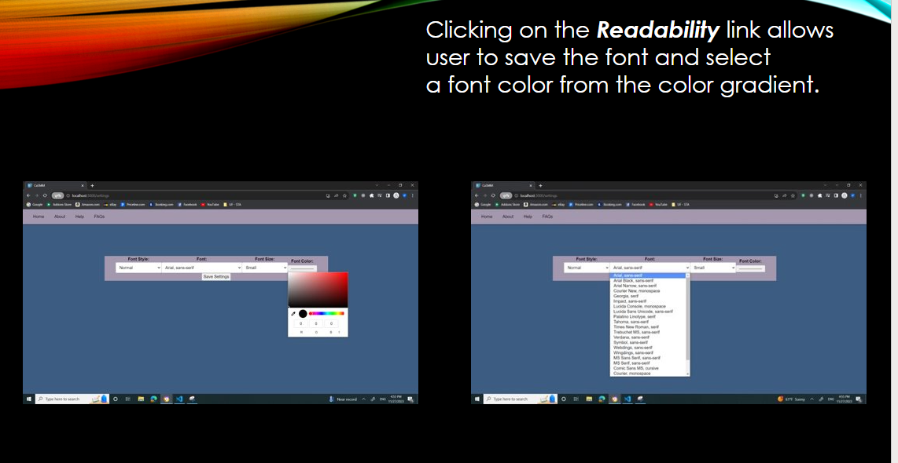
  </a>
</p>
<p align="center">
  <a href="https://github.com/CEN3031-Group9c/sapphire-project01-9c/tree/testing-branch">
    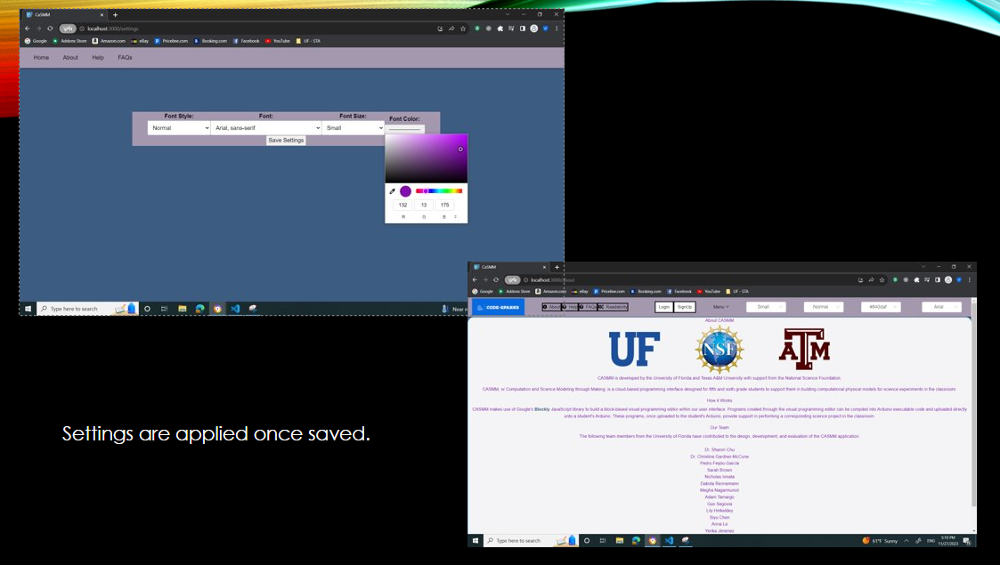
  </a>
</p>
G) Updated Landing page layout for better visualization  
<p align="center">
  <a href="https://github.com/CEN3031-Group9c/sapphire-project01-9c/tree/testing-branch">
    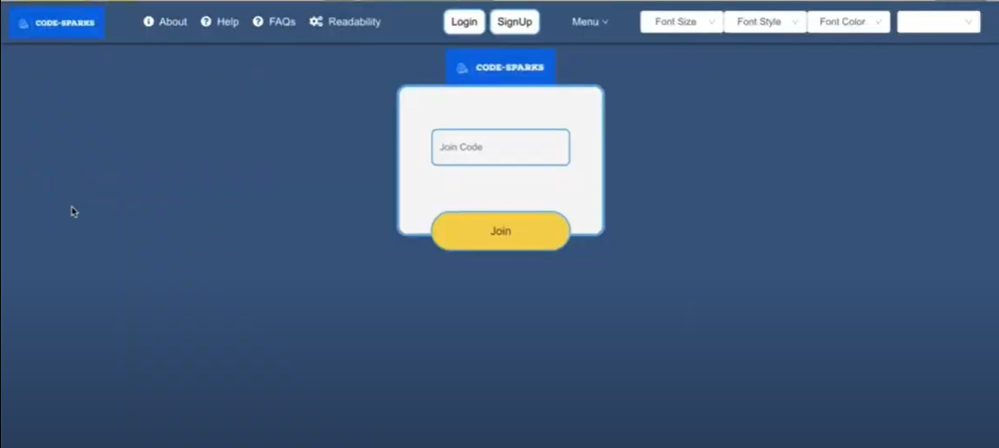
  </a>
</p>
H) Add a footer for better site cohesion and style  
<p align="center">
  <a href="https://github.com/CEN3031-Group9c/sapphire-project01-9c/tree/testing-branch">
    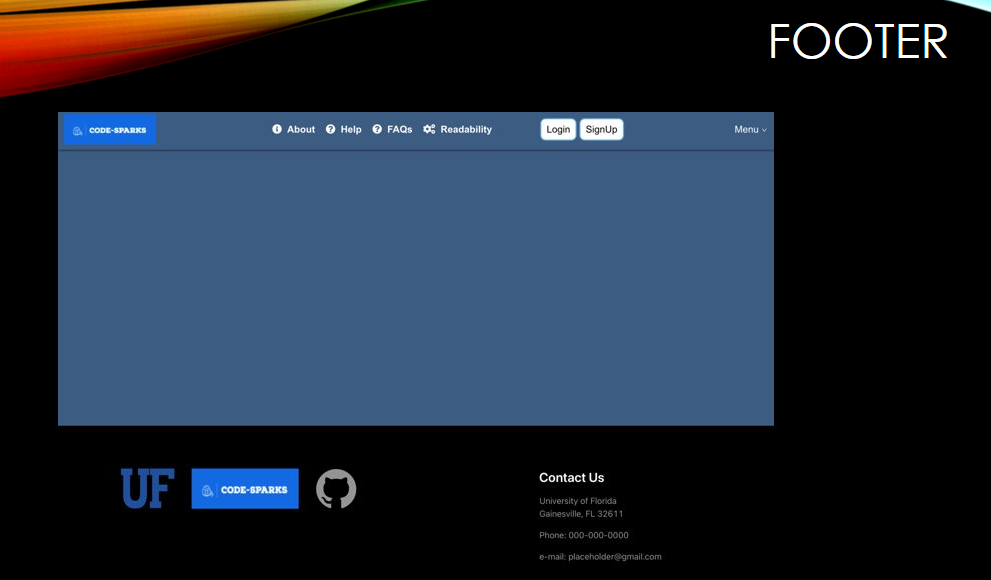
  </a>
</p>
I) Implementation of Help Page 
<p align="center">
  <a href="https://github.com/CEN3031-Group9c/sapphire-project01-9c/tree/testing-branch">
    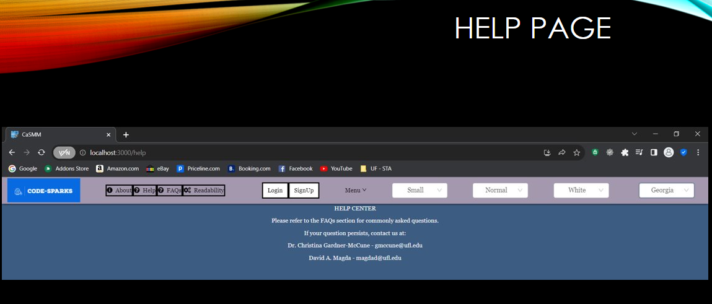
  </a>
</p>
J) Screen Reading    
<p align="center">
  <a href="https://github.com/CEN3031-Group9c/sapphire-project01-9c/tree/testing-branch">
    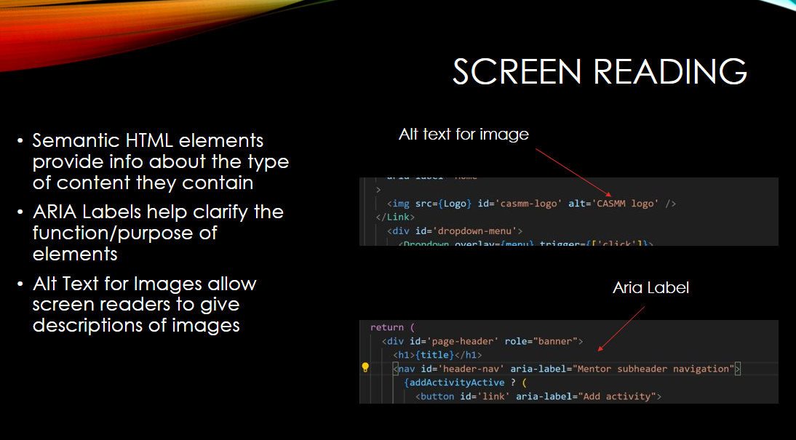
  </a>
</p>

## Installation 

### Clone the repo
<br/>
 Clone the `testing-branch` of the repository at `https://github.com/CEN3031-Group9c/sapphire-project01-9c.git`. 
<br/>


```bash
git clone --branch testing-branch https://github.com/CEN3031-Group9c/sapphire-project01-9c.git
```

or

```bash
git clone -b testing-branch https://github.com/CEN3031-Group9c/sapphire-project01-9c.git
```
## Built upon
<br/>
HTML, CSS, React (JavaScript library)
<br/>

## Application

### `client` 
[client](/client#client) is the frontend of the application. It is powered by [React](https://reactjs.org/) and [Blockly](https://developers.google.com/blockly).

### `server`

[server](/server#server) is the web server and application server. It is powered by [Node](https://nodejs.org/en/) and [Strapi](https://docs-v3.strapi.io/developer-docs/latest/getting-started/introduction.html).

### `compile`

  [compile](/compile#compile) is an arduino compiler service. It is an unofficial fork of [Chromeduino](https://github.com/spaceneedle/Chromeduino).

<br/>

## Video walk through
<br/>
(https://drive.google.com/drive/folders/1bUR6YY55WtoKYku4DTaDlQ6UVCy6K3r6)
<br/>
## Environments

> The project is divided into three conceptual environments.

### Development
#### Structure

The development environment is composed of five servers. The first one is run with the [Create React App](https://create-react-app.dev/docs/getting-started/) dev server. The later four are containerized with docker and run with [docker compose](https://docs.docker.com/compose/).

* `casmm-client-dev` - localhost:3000

* `casmm-server-dev` - localhost:1337/admin

* `casmm-compile-dev` 

* `casmm-db-dev` - localhost:5432

  > The first time the db is started, the [init_db.sh](/scripts/init_db.sh) script will run and seed the database with an environment specific dump. Read about Postgres initialization scripts [here](https://github.com/docker-library/docs/blob/master/postgres/README.md#initialization-scripts). To see how to create this dump, look [here](https://github.com/DavidMagda/CaSMM_fork_2023/blob/develop/scripts/readme.md).

* `casmm-compile_queue-dev`

#### Running

`casmm-client-dev`

1. Follow the [client](/client#setup) setup
2. Run `yarn start` from `/client`

`casmm-server-dev`, `casmm-compile-dev`, `casmm-db-dev`, and `casmm-compile_queue-dev`

1. Install [docker](https://docs.docker.com/get-docker/)

2. Run `docker compose up` from `/`

   > Grant permission to the **scripts** and **server** directories if you are prompted
   

### Staging

#### Structure

The staging environment is a Heroku app. It is composed of a web dyno, compile dyno, Heroku Postgres add-on, and Heroku Redis add-on.

* `casmm-staging` - [casmm-staging.herokuapp.com](https://casmm-staging.herokuapp.com/)
  * The web dyno runs `server`
  * The compile dyno runs `compile`

#### Running

`casmm-staging` is automatically built from the latest commits to branches matching `release/v[0-9].[0-9]`. Heroku runs the container orchestration from there.

### Production

#### Structure

The production environment is a Heroku app. It is composed of a web dyno, compile dyno, Heroku Postgres add-on, and Heroku Redis add-on.

* `casmm` - [www.casmm.org](https://www.casmm.org/)
  * The web dyno runs `server`
  * The compile dyno runs `compile`

#### Running

`casmm` is automatically built from the latest commits to `master`. Heroku runs the container orchestration from there.

<br/>

## Maintenance

All three components of the application have their own dependencies managed in their respective `package.json` files. Run `npm outdated` in each folder to see what packages have new releases. Before updating a package (especially new major versions), ensure that there are no breaking changes. Avoid updating all of the packages at once by running `npm update` because it could lead to breaking changes. 

### Strapi

This is by far the largest and most important dependency we have. Staying up to date with its [releases](https://github.com/strapi/strapi/releases) is important for bug/security fixes and new features. When it comes to actually upgrading Strapi make sure to follow the [migration guides](https://docs-v3.strapi.io/developer-docs/latest/update-migration-guides/migration-guides.html#v3-guides)!

<br/>

## CI/CD

All of the deployments and releases are handled automatically with [GitHub Actions](https://docs.github.com/en/actions). The workflows implement custom [Actions](https://github.com/STEM-C/CaSMM/actions) that live in the [auto](https://github.com/STEM-C/auto) repo.

<br/>

## Contributing

### Git Flow 

> We will follow this git flow for the most part — instead of individual release branches, we will have one to streamline staging deployment 


### Branches

#### Protected

> Locked for direct commits — all commits must be made from a non-protected branch and submitted via a pull request with one approving review

- **master** - Production application

#### Non-protected

> Commits can be made directly to the branch

- **release** - Staging application
- **develop** - Working version of the application
- **feature/<`scaffold`>-<`feature-name`>** - Based off of develop
  - ex. **feature/cms-strapi**
- **hotfix/<`scaffold`>-<`fix-name`>** - Based off of master
  - ex. **hotfix/client-cors**

### Pull Requests

Before submitting a pull request, rebase the feature branch into the target branch to resolve any merge conflicts.

- PRs to **master** should squash and merge
- PRs to all other branches should create a merge commit
